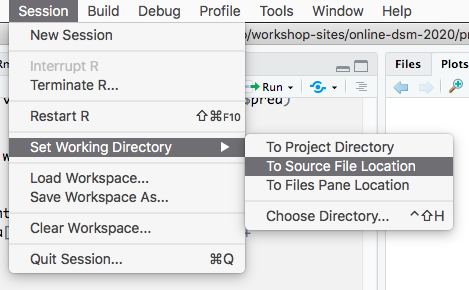

# Frequently asked questions

## `cannot open the connection` and `No such file or directory` when loading data

First: make sure that you downloaded the data. For the practicals you need [`spermwhale.RData`](../data/spermwhale.RData), which contains all the R objects you will need.

Then: this is often caused by the data not being in the working directory that R/RStudio is using. You can check the current working directory using the following:

```r
getwd()
```

In RStudio you can quickly switch to the directory that your current open Rmarkdown/R source file is in using the `Session` menu item:



## R requirements

Please make sure you have the latest version of R on your computer (version 4). You can download this from: [https://cran.r-project.org/](https://cran.r-project.org/)

Once R is installed, please run the following line of code:

```r
install.packages(c("rmarkdown", "Distance", "ggplot2", "knitr",
                   "dsm", "patchwork", "plyr"))
```

to ensure that you have the latest versions of all the R packages you need for the course.

Note that this might take a while depending on your internet connection speed.


