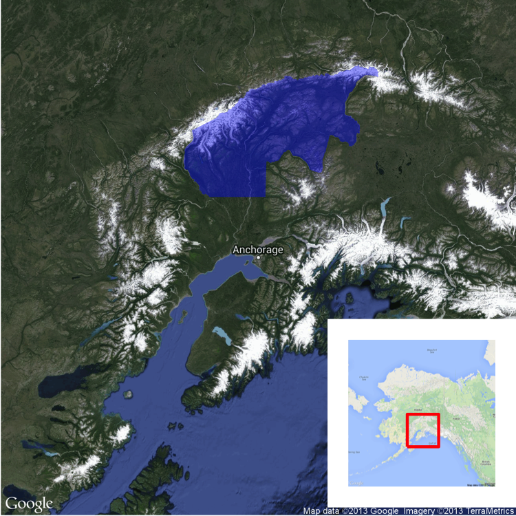
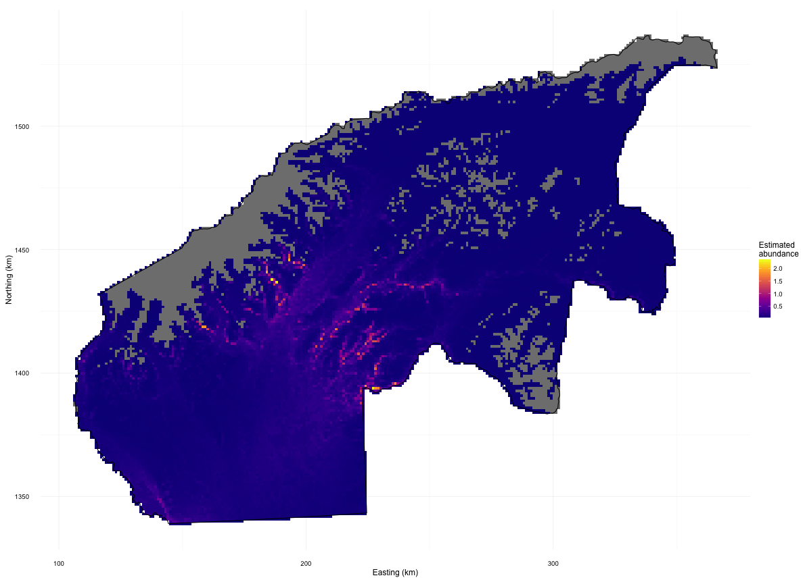
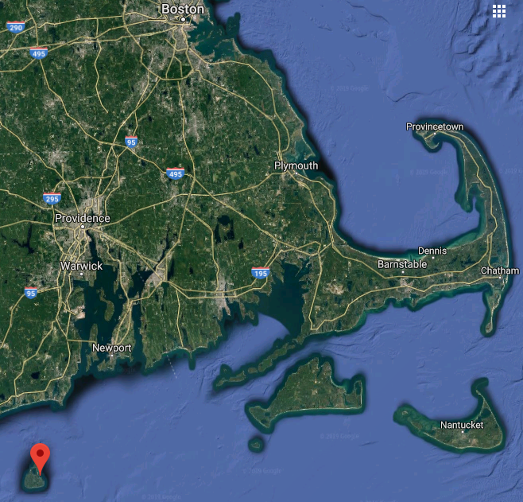
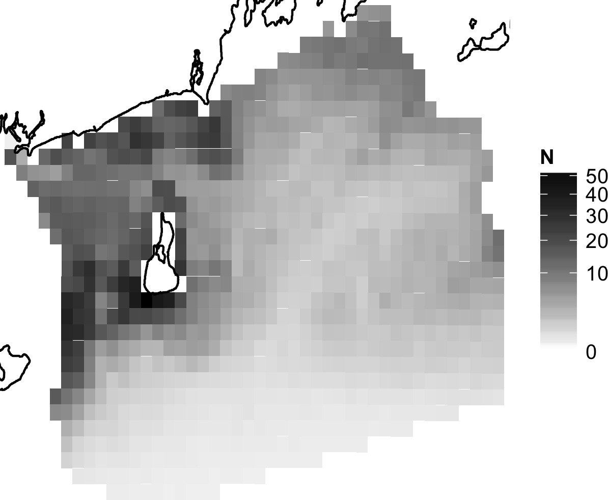
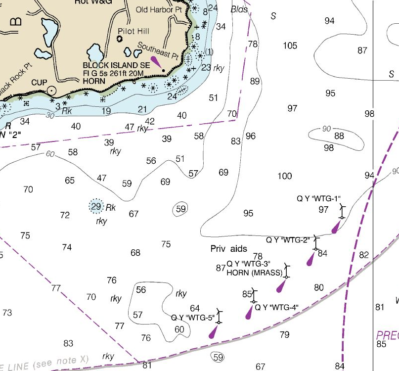
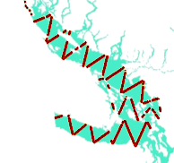
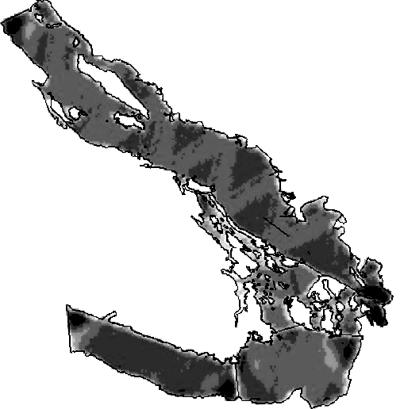
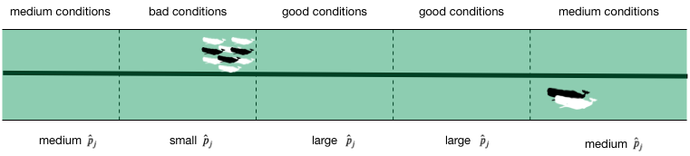

```{r setup, include=FALSE}
# setup
library(knitr)
library(magrittr)
library(viridis)
opts_chunk$set(cache=TRUE, echo=FALSE, warning=FALSE, error=FALSE,
               message=FALSE, fig.height=8, fig.width=10)

# some useful libraries
library(RColorBrewer)
library(ggplot2)
library(cowplot)
library(sf)
library(rnaturalearth)
theme_set(theme_cowplot(20))

# load the sperm whale data set
load("../data/spermwhale.RData")
```

class: title-slide, inverse, center, middle

# Lecture 1: distance sampling & density surface models

<div style="position: absolute; bottom: 15px; vertical-align: center; left: 10px">

</div>

---

class: inverse, middle, center

# Why model abundance spatially?

---
class: inverse, middle, center

# Maps

---

.pull-left[


]

.pull-right[
- Black bears in Alaska
- Heterogeneous spatial distribution

]

---
class: inverse, middle, center

# Spatial decision making

---

.pull-left[


]

.pull-right[
- Block Island, Rhode Island
- First offshore wind in the USA
- Spatial impact assessment


]

---

class: inverse, middle, center

# Back to regular distance sampling

---

# How many animals are there? (500!)

```{r, plot, echo=FALSE}
# code adapted from my RDistance book, converged.yt/RDistanceBook
set.seed(1234) # same results every time
library(mgcv) # for inSide

N <- 500
# generate population locations
x <- runif(N)
y <- runif(N)
# plot it
par(mar=rep(0,4))
plot(x,y, pch=19,asp=1,cex=0.4,main="",col="black", axes=FALSE, xlab="", ylab="")
polygon(x=c(0,1,1,0,0), y=c(0,0,1,1,0))
```

---

# Plot sampling


```{r, plotsampling, echo=FALSE}
par(mar=rep(0,4))
plot(x,y, pch=19,asp=1,cex=0.4,main="",col="black", axes=FALSE, xlab="", ylab="")
polygon(x=c(0,1,1,0,0), y=c(0,0,1,1,0))

# generate some quadrats
set.seed(3111)# same results every time
quadrat <- list(x=c(0,0,0.1,0.1,0),y=c(0,0.1,0.1,0,0))
n <- 0
for(i in 1:10){
  # randomly place a quadrat (and plot it)
  this.quadrat <- quadrat
  this.quadrat$x <- this.quadrat$x + runif(1, 0.1, 0.9)
  this.quadrat$y <- this.quadrat$y + runif(1, 0.1, 0.9)
  polygon(this.quadrat, lty=2, border="blue")
  # see which points are inside
  inout <- inSide(this.quadrat, x, y)
  # count them
  n <- n + sum(inout)
  # plot the points inside the quadrat in red
  points(x[inout], y[inout], pch=19, cex=0.6, col="red")
}
```


- Surveyed 10 quadrats (each $0.1^2$ units)
  - Total covered area $a=10 * 0.1^2 =$ `r 10*0.1^2`
- Saw $n=$ `r n` animals
- Estimated density $\hat{D}=n/a=$ `r n/(10*0.1^2)`
- Total area $A=1$
- Estimated abundance $\hat{N}=\hat{D}A=$ `r  n/(10*0.1^2)`

---

# Strip transect

```{r strip}
par(mar=rep(0,4))
plot(x,y, pch=19,asp=1,cex=0.4,main="",col="black", axes=FALSE, xlab="", ylab="")
polygon(x=c(0,1,1,0,0), y=c(0,0,1,1,0))

# zero the count from last time
n <- 0

# generate some strips
set.seed(12)
# in this case we don't randomise the offset of the grid
strip <- list(x=c(-0.0125,-0.0125,0.0125,0.0125,-0.0125), y=c(0,1,1,0,0))
strip$x <- strip$x + 0.1
for(i in 1:4){
  # plot the strip and its centreline
  polygon(strip, lty=2, border="blue")
  lines(rep(mean(range(strip$x)),2), c(0,1), col="blue")
  # see what was inside the strip
  inout <- inSide(strip,x,y)
  # count them
  n <- n + sum(inout)
  # plot those animals within the strip
  points(x[inout], y[inout], pch=19, cex=0.6, col="red")
  # calculate next strip location
  strip$x <- strip$x+0.2
}
# covered area -- same area as for the quadrats
covered <- 4*1*0.025
# estimate density
D <- n/covered
# area of the survey region
A <- 1
# estimate abundance
Nhat <- D*A
```


- Surveyed 4 lines (each $1*0.025$ units)
  - Total covered area $a=4*1*0.025 =$ `r covered`
- Saw $n=$ `r n` animals
- Estimated density $\hat{D}=n/a=$ `r D`
- Total area $A=1$
- Estimated abundance $\hat{N}=\hat{D}A=$ `r  Nhat`

---

# Detectability matters!


- We've assumed certain detection so far
- This rarely happens in the field
- Distance to the **object** is important
- Detectability should decrease with increasing distance

---

# Distance and detectability


<small>Credit <a href="http://www.nordhavn.com/egret/captains_log_sept11.php">Scott and Mary Flanders</a></small>


---

# Line transect

```{r lt}
par(mar=rep(0,4))
plot(x,y, pch=19,asp=1,cex=0.6,main="",col="black", axes=FALSE, xlab="", ylab="")
polygon(x=c(0,1,1,0,0), y=c(0,0,1,1,0))

# generate some lines
# in this case we don't randomise the offset of the grid
lt <- list(x=c(-0.0125, -0.0125, 0.0125, 0.0125, -0.0125),  y=c(0, 1, 1, 0, 0))
# set sigma
sigma <- 0.01
# storage for detected distances
detected_distances <- c()
for(i in 1:4){
  # calculate next strip location
  lt$x <- lt$x+0.15
  # plot the line transect
  lines(x=rep(mean(range(lt$x)),2), y=c(0,1), col="blue",lty=2)
  # calculate the distances to animals from the line
  distances <- abs(lt$x - x)
  # randomly decide which were detected
  detected <- exp(-distances^2/(2*sigma^2)) > runif(length(distances))
  # plot those animals detected
  points(x[detected], y[detected], pch=19, cex=0.6, col="red")
  # collect the distances to detected objects
  detected_distances <- c(detected_distances, distances[detected])
}
```

---

# Line transects - distances


```{r distance-hist}
hist(detected_distances, main="", xlab="Distance",breaks=seq(0,max(detected_distances),len=7))
```
 
- Distances from the **line** (sampler) to animal
- Now we recorded distances, what do they look like?
- "Fold" distribution over, left/right doesn't matter
- Drop-off in # observations w. increasing distance

---

# Distance sampling animation


---

# Detection function


```{r df-fit}
hist(detected_distances, main="", xlab="Distance",breaks=seq(0,max(detected_distances),len=7), freq=FALSE, ylim=c(0, 85), axes=FALSE, ylab="Probability of detection")
xx <- seq(0, 0.05, len=1000)
lines(xx, exp(-xx^2/(2*sigma^2))/integrate(function(x)  exp(-x^2/(2*sigma^2)), lower=0, upper=0.02)$value)
axis(1)
g0 <- 1/integrate(function(x)  exp(-x^2/(2*sigma^2)), lower=0, upper=0.02)$value
axis(2, at=c(0, g0/2, g0), labels=c(0,0.5,1))
```

---

# Distance sampling estimate


```{r calc-Nhat-line, echo=FALSE}
## calculate Nhat
# calculate mu, since we know sigma and set w=0.02
# calculate p = mu/w
p <- mu/0.02
n<-length(detected_distances)
covered <- 2*0.02*5
Nhat.lt <- A*n/(covered*p)
```


- Surveyed 5 lines (each $1*0.025$ units)
  - Total covered area $a=5*1*0.02 =$ `r covered`
- Probability of detection $\hat{p} =$ `r round(p,4)`
- Saw $n=$ `r n` animals
- Inflate to $n/\hat{p}=$ `r round(n/p, 3)`
- Estimated density $\hat{D}=\frac{n/\hat{p}}{a}=$ `r round(n/(covered*p), 0)`
- Total area $A=1$
- Estimated abundance $\hat{N}=\hat{D}A=$ `r  round(Nhat.lt, 0)`

---

# Reminder of assumptions


1. Animals are distributed independent of lines

2. On the line, detection is certain

3. Distances are recorded correctly

4. Animals don't move before detection


---

# What are detection functions?


- Model $\mathbb{P}\left( \text{detection } \vert \text{ animal at distance } x \right)$
- "Integrate out distance" == "area under curve" == $\hat{p}$
- Many different forms, depending on the data
- All share some characteristics

```{r df-hn, echo=FALSE, fig.height=3}
par(mfrow=c(1,3))

curve(exp(-x^2/(2*0.01^2)), from=0, to=0.025, xlab="Distance", ylab="Probability of detection", main="Half-normal")

curve(1-exp(-(x/0.005)^(-2.5)), from=0, to=0.025, xlab="Distance", ylab="Probability of detection", main="Hazard-rate")


g <- function(x) exp(-x^2/(2*0.01^2))*(1+0.5*cos((2*pi*x)/0.025))
f <- function(x) g(x)/g(0)
curve(f, from=0, to=0.025, xlab="Distance", ylab="Probability of detection", main="Half-normal with 1 cosine adjustment")
```

---

# Fitting detection functions (in R!)

- Using the package `Distance`
- Function `ds()` does most of the work
- More on this in the practical!

```{r echo=TRUE}
library(Distance)
df_hn <- ds(distdata, truncation=6000)
```

---


# Horvitz-Thompson-like estimators

- Once we have $\hat{p}$ how do we get $\hat{N}$?
- Rescale the (flat) density and extrapolate

$$
\hat{N} = \frac{\text{study area}}{\text{covered area}}\sum_{i=1}^n \frac{s_i}{\hat{p}_i}
$$

- $s_i$ are group/cluster sizes
- $\hat{p}_i$ is the detection probability (from detection function)

---

# Hidden in this formula is a simple assumption


- Probability of sampling every point in the study area is equal
- Is this true? Sometimes.
- If (and only if) the design is randomised


---

# Many faces of randomisation


```{r randomisation, fig.width=14, fig.height=4.5, out.width='\\textwidth'}
set.seed(12133)
par(mfrow=c(1,3), cex.main=2.5)

# true random sample
plot(c(0, 1), c(0, 1), type="n", xlab="", ylab="", axes=FALSE, asp=1, main="random placement")
dat <- data.frame(x=runif(10), y=runif(10))
angle <- runif(10, 0, 2*pi)
len <- 0.2
arrows(dat$x, dat$y, dat$x+len*cos(angle), dat$y+len*sin(angle), length=0)
dat <- data.frame(x=runif(10), y=runif(10))
angle <- runif(10, 0, 2*pi)
len <- 0.2
arrows(dat$x, dat$y, dat$x+len*cos(angle), dat$y+len*sin(angle), length=0, col="grey40", lty=2)
box()

# parallel random offset
plot(c(0, 1), c(0, 1), type="n", xlab="", ylab="", axes=FALSE, asp=1, main="random offset parallel lines")
abline(v=seq(0, 1, len=10))
abline(v=seq(0, 1, len=10)+0.07, col="grey40", lty=2)
box()

# random offset zigzag

## make a zigzag
n_segs <- 10
zz <- data.frame(x   = c(seq(0, 0.5, len=n_segs),
                         seq(0.5, 1, len=n_segs)),
                 y   = c(seq(0, 1, len=n_segs),
                         seq(1, 0, len=n_segs)))
# many zigzags
mzz <- rbind(zz,zz,zz)
mzz$x <- mzz$x/3
ind <- 1:nrow(zz)
mzz$x[ind+nrow(zz)] <- mzz$x[ind+nrow(zz)]+1/3
mzz$x[ind+2*nrow(zz)] <- mzz$x[ind+2*nrow(zz)]+2/3

plot(mzz, type="l", xlab="", ylab="", axes=FALSE, asp=1, main="random offset zigzag")
lines(mzz$x+0.06, mzz$y, col="grey40", lty=2)
box()
```

---

# Randomisation & coverage probability

- H-T equation above assumes even coverage
  - (or you can estimate)

  

---

# Extra information

```{r plottracks, echo=FALSE}
# get track shapefile
tracks <- read_sf("../data/transects.shp")

# get a coastline for plotting
usa <- ne_countries(scale=50, type="countries", country="United States of America", returnclass="sf")
usa <- st_crop(usa, st_bbox(tracks) + c(-2, -1, 1, 0.8))

# plot
p_maptr <- ggplot()+
  geom_sf(aes(colour=Survey), data=tracks) + 
  geom_sf(data=usa, colour=NA) +
  coord_sf(expand=FALSE, crs=proj) +
  theme_minimal()
print(p_maptr)
```

```{r save-mapstuff, echo=FALSE}
save(usa, tracks, file="geosave.RData")
```

---


# Extra information - depth


```{r plotdepth}
p <- ggplot() +
  geom_sf(data=usa, colour=NA) +
  geom_tile(aes(x=x, y=y, fill=Depth), data=predgrid) + 
  geom_point(aes(x=x, y=y, size=size), alpha=0.6, data=distdata) +
  coord_sf(expand=FALSE, crs=proj) +
  theme_minimal() +
  scale_fill_viridis_c()
print(p)
```

---

# Extra information - SST


```{r plotsst, fig.width=10}
p <- ggplot() +
  geom_sf(data=usa, colour=NA) +
  geom_tile(aes(x=x, y=y, fill=SST), data=predgrid) + 
  geom_point(aes(x=x, y=y, size=size), alpha=0.6, data=distdata) +
  coord_sf(expand=FALSE, crs=proj) +
  theme_minimal() +
  scale_fill_viridis_c()
print(p)
```

---

class: inverse, middle, center

# We should model that!

---

# DSM flow diagram


---

# Modelling requirements


- Include detectability
- Account for effort
- Flexible/interpretable effects
- Predictions over an arbitrary area


---

class: inverse, middle, center

# Accounting for effort

---

# Effort

.pull-left[
```{r tracks2, fig.width=10}
print(p_maptr)
```
]

.pull-right[
- Have transects
- Variation in counts and covars along them
- Want a sample unit w/ minimal variation
- "Segments": chunks of effort
]

---


# Chopping up transects


[Physeter catodon by Noah Schlottman](http://phylopic.org/image/dc76cbdb-dba5-4d8f-8cf3-809515c30dbd/)


---

class: inverse, middle, center

# Flexible, interpretable effects


---


# Smooth response


```{r plotsmooths, messages=FALSE}
library(Distance)
library(dsm)
par(ps=20)
df <- ds(distdata, truncation=6000)
dsm_tw_xy_depth <- dsm(count ~ s(x, y) + s(Depth), ddf.obj=df, observation.data=obs, segment.data=segs, family=tw())
plot(dsm_tw_xy_depth, select=2)
```


---

# Explicit spatial effects


```{r plot-spat-smooths, messages=FALSE}
vis.gam(dsm_tw_xy_depth, view=c("x","y"), plot.type="contour", main="", asp=1, too.far=0.06, n.grid=100)
```


---

class: inverse, middle, center

# Predictions

---

# Predictions over an arbitrary area

.pull-left[

```{r predplot}
predgrid$Nhat <- predict(dsm_tw_xy_depth, predgrid, off.set=predgrid$off.set)
p <- ggplot(predgrid) + 
  geom_sf(data=usa, colour=NA) +
  geom_tile(aes(x=x, y=y, fill=Nhat, width=10*1000, height=10*1000)) +
  labs(fill="Density") +
  coord_sf(expand=FALSE, crs=proj) +
  theme_minimal() +
  scale_fill_viridis_c()
print(p)
```
]

.pull-right[
- Don't want to be restricted to predict on segments
- Predict within survey area
- Extrapolate outside (with caution)
- Working on a grid of cells
]

---

class: inverse, middle, center

# Detection information

---
# Including detection information

- Two options:
  - adjust areas to account for **effective effort**
  - use **Horvitz-Thompson estimates** as response

---
# Count model `count~...`

- Area of each segment, $A_j$
  - use $A_j\hat{p}_j$
- think effective strip width ( $\hat{\mu} = w\hat{p}$ )
- Response is counts per segment
- "Adjusting for effort"
- "Count model"


---
# Estimated abundance `abundance.est~...`

- Effort is area of each segment
- Estimate H-T abundance per segment

$$
\hat{n}_j = \sum_i \frac{s_i}{\hat{p}_i}
$$

(where the $i$ observations are in segment $j$)



---
# Detectability and covariates

- 2 covariate "levels" in detection function
  - "Observer"/"observation" -- change **within** segment
  - "Segment" -- change **between** segments
- "Count model" only lets us use segment-level covariates
- "Estimated abundance" lets us use either

---
# When to use each approach?

- Generally "nicer" to adjust effort
- Keep response (counts) close to what was observed
- **Unless** you want observation-level covariates

---
class: inverse, middle, center
# Data requirements

---
# What do we need?

- Need to "link" data
  - ✅ Distance data/detection function
  - ✅ Segment data
  - ✅ Observation data (segments 🔗 detections)

More info on course website.

---


---
class: inverse, middle, center

# Example data


---

# Example data


---


# Example data


---


# Sperm whales 

.pull-left[

]
.pull-right[

- Hang out near canyons, eat squid
- Surveys in 2004, US east coast
- Thanks to Debi Palka (NOAA NEFSC), Lance Garrison (NOAA SEFSC) for data. Jason Roberts (Duke University) for data prep.
]

---

# Recap


- Model counts or estimated abundance
- The effort is accounted for differently
- Flexible models are good
- Incorporate detectability
- 2 tables + detection function needed

