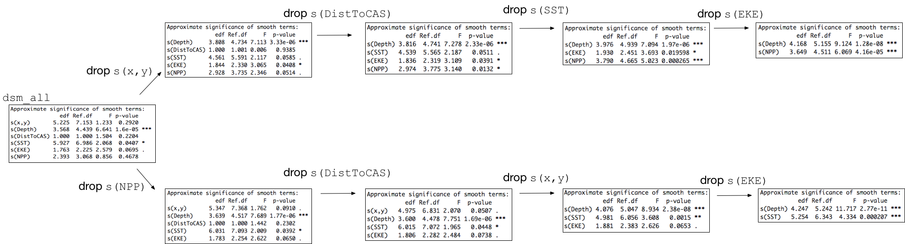
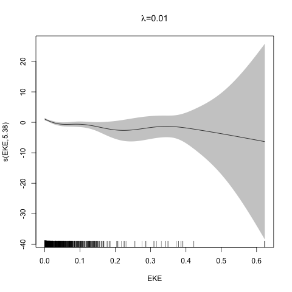

```{r setup, include=FALSE}
# setup
library(knitr)
library(dplyr)
library(tidyr)
library(viridis)
library(reshape2)
library(animation)
opts_chunk$set(cache=TRUE, echo=FALSE, warning=FALSE, error=FALSE,
               message=FALSE)

# some useful libraries
library(RColorBrewer)
library(ggplot2)
library(cowplot)
library(patchwork)
theme_set(theme_cowplot(20))

```

class: title-slide, inverse, center, middle

# Lecture 3: Multivariate smoothing<br/>&<br/>model selection
<div style="position: absolute; bottom: 15px; vertical-align: center; left: 10px">

</div>
---

```{r initialmodeletc, echo=FALSE, message=FALSE, warning=FALSE}
load("../data/spermwhale.RData")
library(Distance)
library(dsm)
library(mgcv)
df_hr <- ds(distdata, truncation=6000, key="hr")
dsm_tw_xy_depth <- dsm(count ~ s(x, y) + s(Depth), ddf.obj=df_hr, observation.data=obs, segment.data=segs, family=tw())
```

# The story so far...

- How GAMs work
- How to include detection info
- Simple spatial-only models

---
# Life isn't that simple

- Which enivronmental covariates?
- Which response distribution?
- Which response?

<p align="center"><b>How to select between possible models?</b></p>

---
class: inverse, middle, center
# Adding covariates

---
# Model formulation

- Pure spatial, pure environmental, mixed?
- Prior knowledge of biology/ecology of species
- What are drivers of distribution?
- What data is available?

---
# Sperm whale covariates

```{r plotall, out.height=800, dpi=300}
load("geosave.RData")
p<-list()
for(covname in c("Depth", "SST", "NPP", "DistToCAS", "EKE")){
  p[[covname]] <- ggplot() +
    geom_sf(data=usa, colour=NA) +
    geom_tile(aes_string(x="x", y="y", fill=covname), data=predgrid) + 
    coord_sf(expand=FALSE, crs=proj) +
    theme_minimal() +
    theme(axis.title.x=element_blank(),
          axis.text.x=element_blank(),
          axis.ticks.x=element_blank(),
          axis.title.y=element_blank(),
          axis.text.y=element_blank(),
          axis.ticks.y=element_blank(),
          legend.position="right", legend.key.width=unit(0.005, "npc")) +
    scale_fill_viridis_c()
}

p[["Depth"]] + p[["SST"]] + p[["NPP"]] + p[["DistToCAS"]] + p[["EKE"]]  + plot_layout(ncol = 3, nrow=3)

```

---
class: inverse, middle, center
# Tobler's first law of geography

## *"Everything is related to everything else, but near things are more related than distant things"*

### Tobler (1970)

---
# Implications of Tobler's law

```{r pairrrrs, fig.width=10}
plot(segs[, c("x","y","SST","EKE","NPP","Depth")], pch=19, cex=0.4)
```

---
# Adding smooths

- Already know that `+` is our friend
- Can build a big model...

```{r add-all, echo=TRUE}
dsm_all <- dsm(count~s(x, y) +
                     s(Depth) +
                     s(DistToCAS) +
                     s(SST) +
                     s(EKE) +
                     s(NPP),
                  ddf.obj=df_hr,
                  segment.data=segs, observation.data=obs,
                  family=tw())
```

---
# Each `s()` has its own options

- `s(..., k=...)` to adjust basis size
- `s(..., bs="...")` for basis type
- lots more options (we'll see a few here)

---
class: inverse, middle, center

# Now we have a huge model, what do we do?

---
# Term selection

.pull-left[
Two popular approaches:

1. **Stepwise selection** (using $p$-values)
  - Problem: path dependence
2. **All possible subsets**
   - Problem: computationally expensive
   - Problem: fishing?
]
.pull-right[

]

---
# p-values

- Test for *zero effect* of a smooth
- They are **approximate** for GAMs (but useful)
- Reported in `summary`

---
# `summary(dsm_all)`

```{r p-summary}
summary(dsm_all)
```

---
# Path dependence is an issue here

- (silly) Strategy: want all $p\approx 0$ (`***`), remove terms 1-by-1
- Two different universes appear:



This isn't very satisfactory!

---
# Term selection during fitting

```{r term-select, results="hide"}
dats <- dsm_all$dat
goodfit <- gam(count~s(EKE), data=dats, family=tw())
bestlambda <- goodfit$sp

plot_lambda <- function(G, lambdae){
  for(i in 1:10){
    this_fit <- gam(count~s(EKE), data=dats, family=tw(),
                    sp=0.01)
    plot(this_fit, select=1,
         main=substitute(paste(lambda, "=", new_lambda),
                         list(new_lambda=0.01)), shade=TRUE)
    ani.pause()
  }
  for(new_lambda in (seq(0.1, sqrt(100*lambdae[1]), len=50))^2){
    this_fit <- gam(count~s(EKE), data=dats, family=tw(),
                    sp=c(new_lambda))
    plot(this_fit, select=1,
         main=substitute(paste(lambda, "=", new_lambda),
                         list(new_lambda=new_lambda)), shade=TRUE)
    ani.pause()
  }
  for(i in 1:3){
    plot(this_fit, select=1,
         main=substitute(paste(lambda, "=", new_lambda),
                         list(new_lambda=new_lambda)), shade=TRUE)
    ani.pause()
  }

}

saveGIF(plot_lambda(G, bestlambda), "shrinky_dink.gif", interval=0.2)
# weird bug means we need to move this file or next graphic to work
```
.pull-left[
- Already selecting wigglyness of terms
- (via a penalty)
- What about using it to remove the whole term?
]
.pull-right[

]


---
# Shrinkage approach

```{r term-select-ts, results="hide"}
dats <- dsm_all$dat
goodfit <- gam(count~s(EKE, bs="ts"), data=dats, family=tw())
bestlambda <- goodfit$sp

plot_lambda <- function(G, lambdae){

  for(new_lambda in (seq(lambdae[1], sqrt(10000*lambdae[1]), len=50))^2){
    this_fit <- gam(count~s(EKE, bs="ts"), data=dats, family=tw(),
                    sp=c(new_lambda))
    plot(this_fit, select=1,
         main=substitute(paste(lambda, "=", new_lambda),
                         list(new_lambda=new_lambda)), shade=TRUE)
    ani.pause()
  }

  for(i in 1:3){
    plot(this_fit, select=1,
         main=substitute(paste(lambda, "=", new_lambda),
                         list(new_lambda=new_lambda)), shade=TRUE)
    ani.pause()
  }
}

saveGIF(plot_lambda(G, bestlambda), "shrinky_dink_ts.gif", interval=0.2)
# weird bug means we need to move this file or next graphic to work
```
.pull-left[
- Basis `s(..., bs="ts")` - thin plate splines *with shrinkage*
- remove the wiggles **then** remove the "linear" bits
]
.pull-right[

]

---
# Shrinkage example

```{r add-ts, echo=TRUE}
dsm_ts_all <- dsm(count~s(x, y, bs="ts") +
                        s(Depth, bs="ts") +
                        s(DistToCAS, bs="ts") +
                        s(SST, bs="ts") +
                        s(EKE, bs="ts") +
                        s(NPP, bs="ts"),
                  ddf.obj=df_hr,
                  segment.data=segs, observation.data=obs,
                  family=tw())
```

---
# Model with no shrinkage


```{r smooth-no-shrinkage, fig.width=15}
plot(dsm_all, pages=1, scale=0)
```
---
# ... with shrinkage

```{r smooth-shrinkage, fig.width=15}
plot(dsm_ts_all, pages=1, scale=0)
```

---
# `summary(dsm_ts_all)`

```{r ts-summary, echo=FALSE}
summary(dsm_ts_all)
```

---
# EDF comparison

```{r edf-comp, result="asis"}
aa <- cbind(summary(dsm_all)$edf,
            summary(dsm_ts_all)$edf)
rownames(aa) <- rownames(summary(dsm_all)$s.table)
colnames(aa) <- c("tp", "ts")
kable(round(aa, 4), digits=4, format="html")
```

---
# Removing terms?

1. EDF
  - Terms with EDF<1 may not be useful (can we remove?)
2. non-significant $p$-value
  - Decide on a significance level and use that as a rule

(In some sense leaving "shrunk" terms in is more "consistent" in terms of variance estimation, but can be computationally annoying)

---
class: inverse, middle, center

# Comparing models

---
# Comparing models

- Usually have >1 option
- How can we pick?
- Even if we have 1 model, is it any good?

(This can be subtle, more in model checking tomorrow!)

---
# Akaike's "An Information Criterion"

- Comparison of AIC fine **but**:
  - can't compare Tweedie (continuous) and negative binomial (discrete) distributions!
  - (*within* distribution is fine)

```{r aic, echo=TRUE}
AIC(dsm_all)
AIC(dsm_ts_all)
```

---
class: inverse, middle, center
# Selecting between response distributions

---
# Goodness of fit

- Q-Q plots
- Closer to the line is better
- But what does "close" mean?
```{r gof-qq, fig.width=18}
dsm_x_nb <- dsm(count~s(x, bs="ts"),
                ddf.obj=df_hr,
                segment.data=segs, observation.data=obs,
                family=nb(), method="REML")
par(mfrow=c(1,2), cex.title=3, cex.axis=1.5, cex.lab=1.5, lwd=2)
qq.gam(dsm_all, asp=1, main="Tweedie", cex=5)
qq.gam(dsm_x_nb, asp=1, main="Negative binomial", cex=5)
```

---
# Using reference bands

- What is down to random variation?
- Resampling the response, generate bands
- Better idea of how close we are

```
qq.gam(dsm_all, asp=1, main="Tweedie",
       cex=5, rep=100)
```

```{r gof-qq-ref, fig.width=18}
par(mfrow=c(1,2), cex.title=3, cex.axis=1.5, cex.lab=1.5, lwd=2)
qq.gam(dsm_all, asp=1, main="Tweedie", cex=5, rep=100)
qq.gam(dsm_x_nb, asp=1, main="Negative binomial", cex=5, rep=100)
```

---
class: inverse, middle, center
# Which response type?

---
# Count model `count~...`

- Effort is effective effort
- Response is count per segment


---
# Estimated abundance `abundance.est~...`

- Effort is area of each segment
- Response is estimated abundance per segment


---
# When to use each approach?

- *Practical choice*
- 2 detection function covariate "levels"
  - "Observer"/"observation" -- change **within** segment
  - "Segment" -- change **between** segments
- "Count model" only lets us use segment-level covariates
- "Estimated abundance" lets us use either

---
# Sperm whale response example (either)

.pull-left[
- Detection covariate: Beaufort
- Changes at segment level
- `count` or `abundance.est`
]

.pull-right[
```{r plot-beauf}
# plot beaufort
p_maptr <- ggplot()+
  geom_sf(aes(colour=cut(SeaStat, 0:6)), size=2, data=tracks) + 
  geom_sf(data=usa, colour=NA) +
  coord_sf(expand=FALSE, crs=proj) +
  labs(colour="Beaufort") +
  theme_minimal()
print(p_maptr)
```
]

---
# Sperm whale response example (`abundance.est`)

.pull-left[
- Detection covariate: group size (`size`)
- Changes at observation level
- `abundance.est` only
]

.pull-right[
```{r plot-size}
obs_s <- subset(obs, size>0)
p_maptr <- ggplot()+
  geom_point(aes(x=x, y=y, size=size), alpha=0.4, data=obs_s) + 
  geom_sf(data=usa, colour=NA) +
  coord_sf(expand=FALSE, crs=proj) +
  theme_minimal()
print(p_maptr)

```
]


---
class: inverse, middle, center
# Recap

---
# Recap

- Adding smooths
- Path dependence
- Removing smooths
  - $p$-values
  - shrinkage
- Comparing models
- Comparing response distributions
