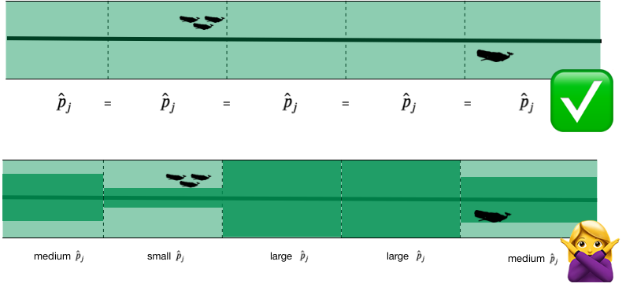
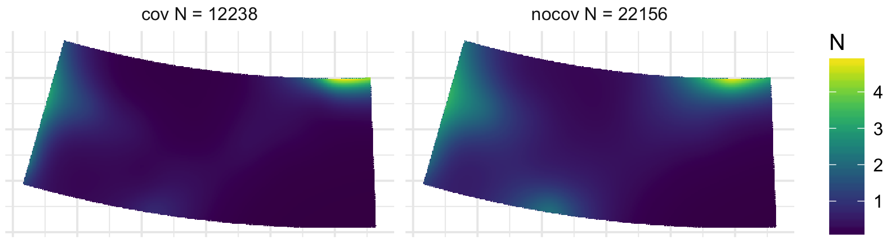

```{r setup, include=FALSE}
# setup
library(knitr)
library(magrittr)
library(viridis)
library(reshape2)
library(animation)
opts_chunk$set(cache=TRUE, echo=FALSE, warning=FALSE, error=FALSE, message=FALSE)

# some useful libraries
library(RColorBrewer)
library(ggplot2)
library(cowplot)
library(sf)
library(rnaturalearth)
library(patchwork)
theme_set(theme_cowplot(20))

options(width = 60)

```

class: title-slide, inverse, center, middle

# Lecture 5: Predictions<br/>and<br/>variance

<div style="position: absolute; bottom: 15px; vertical-align: center; left: 10px">

</div>

---


```{r initialmodeletc, echo=FALSE, message=FALSE, warning=FALSE}
load("../data/spermwhale.RData")
library(Distance)
library(dsm)
df_hr <- ds(distdata, truncation=6000, key="hr")
dsm_tw_xy_depth <- dsm(count ~ s(x, y) + s(Depth), ddf.obj=df_hr, observation.data=obs, segment.data=segs, family=tw())
# fit a quick model from previous exericises
dsm_all_tw_rm <- dsm(count~s(x, y, bs="ts") +
                           s(Depth, bs="ts"),
                     ddf.obj=df_hr,
                     segment.data=segs, observation.data=obs,
                     family=tw(), method="REML")
```

# So far...

- Build, check & select *detection* models
- Build, check & select *spatial* models

<p align="center"><b>What about predictions?</b></p>


---
class: inverse, middle, center
# Let's talk about maps

---
# What does a map mean?

.pull-left[
```{r predmap1}
# make a prediction
predgrid$Nhat_tw <- predict(dsm_all_tw_rm, predgrid, off.set=predgrid$off.set)

# plot
p_map_pred <- ggplot()+
  geom_tile(aes(x=x, y=y, fill=Nhat_tw), data=predgrid) +
  theme_minimal() +
  theme(legend.position="bottom") +
  coord_equal()
print(p_map_pred)

# kill this again since we don't want it popping up later
predgrid$Nhat_tw <- NULL
```
]

.pull-right[
- Grids!
- Cells are abundance estimate
- "snapshot"
- Sum cells to get abundance
- Sum a subset?
]

---
# Going back to the formula

Count model ( $j$ observations):

$$
n_j = A_j\hat{p}_j \exp\left[ \beta_0 + s(\text{y}_j) + s(\text{Depth}_j) \right] + \epsilon_j
$$

<br/>
Predictions (index $r$):

$$
\hat{n}_r = A_r \exp\left[ \hat{\beta}_0 + \hat{s}(\text{y}_r) + \hat{s}(\text{Depth}_r) \right]
$$

<br/>
Need to "fill-in" values for $A_r$, $\text{y}_r$ and $\text{Depth}_r$.

---
# Predicting

- With these values can use `predict` in R
- `predict(model, newdata=data, off.set=off.set)`

- `off.set` gives the area of the grid cells
- more info in `?predict.dsm`

---
# Prediction data

```{r preddata}
head(predgrid)
```

---
# Predictors

```{r preddata-plot, out.height=800, dpi=200}
load("geosave.RData")
p<-list()
for(covname in c("Depth", "SST", "NPP", "DistToCAS", "EKE")){
  p[[covname]] <- ggplot() +
    geom_sf(data=usa, colour=NA) +
    geom_tile(aes_string(x="x", y="y", fill=covname), data=predgrid) + 
    coord_sf(expand=FALSE, crs=proj) +
    theme_minimal() +
    theme(axis.title.x=element_blank(),
          axis.text.x=element_blank(),
          axis.ticks.x=element_blank(),
          axis.title.y=element_blank(),
          axis.text.y=element_blank(),
          axis.ticks.y=element_blank(),
          legend.position="right", legend.key.width=unit(0.005, "npc")) +
    scale_fill_viridis_c()
}

p[["Depth"]] + p[["SST"]] + p[["NPP"]] + p[["DistToCAS"]] + p[["EKE"]]  + plot_layout(ncol = 3, nrow=3)
```

---
# Making a prediction

- Add another column to the prediction data
- Plotting then easier (in R)

```{r predictions, echo=TRUE}
predgrid$Nhat_tw <- predict(dsm_all_tw_rm,
                            predgrid,
                            off.set=predgrid$off.set)
```

---
# Maps of predictions

.pull-left[

```{r predmap}
p <- ggplot(predgrid) +
      geom_tile(aes(x=x, y=y, fill=Nhat_tw)) +
      scale_fill_viridis() +
      theme_minimal() +
      theme(legend.position="bottom") +
      coord_equal()
print(p)
```
]
.pull-right[

```{r echo=TRUE, eval=FALSE}
p <- ggplot(predgrid) +
      geom_tile(aes(x=x, y=y,
                    fill=Nhat_tw)) +
      scale_fill_viridis() +
      coord_equal()
print(p)
```
]

---
# Total abundance

Each cell has an abundance, sum to get total

```{r total-abund, echo=TRUE}
sum(predgrid$Nhat_tw)
```

---
# Subsetting

R subsetting lets you calculate "interesting" estimates:

```{r subset-abund, echo=TRUE}
# how many sperm whales at depths shallower than 2500m?
sum(predgrid$Nhat_tw[predgrid$Depth < 2500])
# how many sperm whales East of 0?
sum(predgrid$Nhat_tw[predgrid$x>0])
```

---
class: inverse, middle, center
# Extrapolation

---
# What do we mean by extrapolation?

.pull-left[

- Predicting at values outside those observed
- What does "outside" mean?
  - between transects?
  - outside "survey area"?
]
.pull-right[

```{r plottracks, echo=FALSE}
# get track shapefile
tracks <- read_sf("../data/transects.shp")

# get a coastline for plotting
usa <- ne_countries(scale=50, type="countries", country="United States of America", returnclass="sf")
usa <- st_crop(usa, st_bbox(tracks) + c(-2, -1, 1, 0.8))

# plot
p_maptr <- ggplot()+
  geom_sf(aes(colour=Survey), data=tracks) + 
  geom_sf(data=usa, colour=NA) +
  coord_sf(expand=FALSE, crs=proj) +
  theme_minimal()
print(p_maptr)
```
]

---
# Extrapolation

- In general, try not to do it!
- Variance issues?
- Space-time interchangability?
- `dsmextra` package by Phil Bouchet
  - [https://densitymodelling.github.io/dsmextra/index.html](https://densitymodelling.github.io/dsmextra/index.html)


---
# Prediction recap

* Using `predict`
* Getting "overall" abundance
* Subsetting
* Plotting in R
* Extrapolation (and its dangers)

---
class: inverse, middle, center
# Estimating variance

```{r initialmodeletcunc, echo=FALSE, message=FALSE, warning=FALSE}
dsm_all_tw_rm <- dsm(count~s(x, y, bs="ts") +
                           s(Depth, bs="ts"),
                     ddf.obj=df_hr,
                     segment.data=segs, observation.data=obs,
                     family=tw(), method="REML")
dsm_ts_all <- dsm(count~s(x, y, bs="ts") +
                        s(Depth, bs="ts") +
                        s(DistToCAS, bs="ts") +
                        s(SST, bs="ts") +
                        s(EKE, bs="ts") +
                        s(NPP, bs="ts"),
                  ddf.obj=df_hr,
                  segment.data=segs, observation.data=obs,
                  family=tw())
dsm_all <- dsm(count~s(x, y) +
                        s(Depth) +
                        s(DistToCAS) +
                        s(SST) +
                        s(EKE) +
                        s(NPP),
                  ddf.obj=df_hr,
                  segment.data=segs, observation.data=obs,
                  family=tw())
```

---
class: inverse, middle, center
# Now we can make predictions
## Now we are dangerous.

---
class: inverse, middle, center
# Predictions are useless without uncertainty

---
class: inverse, middle, center
# Where does uncertainty come from?

---
# Sources of uncertainty

- Detection function parameters
- GAM parameters
- (And more! But only looking at these 2 here!)

```{r unc-sources, fig.width=18}
par(mfrow=c(1,2), lwd=2, cex.axis=2, cex.lab=2)
plot(df_hr)
plot(dsm_all_tw_rm, select=2)
```
---
# Uncertianty of what?

- Uncertainty from detection function + GAM
- Want to talk about $\hat{N}$, so need to do some maths
- `dsm` does this for you!
- Details in Miller et al (2013) appendix


---
# GAM + detection function uncertainty

(Getting a little fast-and-loose with the mathematics)

<div style="font-size:150%">
$$
\text{CV}^2\left( \hat{N} \right) \approx \text{CV}^2\left( \text{GAM} \right) +
$$

$$
\text{CV}^2\left( \text{detection function}\right)
$$
</div>
<br/>
<br/>
<p align="center">the "delta method"</p>
---
# When can we use the delta method?

- Assumes detection function and GAM are **independent**
- This is okay if:
  - no detection function covariates


---
# Variance propagation

- When detection function is not independent
- Uncertainty "propagated" through the model
- Refit both models together
- Bravington, Miller and Hedley (2019)
  - [https://arxiv.org/abs/1807.07996](https://arxiv.org/abs/1807.07996)


---
# In R...

- Functions in `dsm` to do this
- `dsm.var.gam`
  - assumes spatial model and detection function are independent
- `dsm.var.prop`
  - propagates uncertainty from detection function to spatial model
  - only works for `count` models
  - covariates can only vary at segment level

---
# Variance of abundance

Using `dsm.var.gam`

```{r, var-tot-abund-gam, echo=TRUE}
dsm_tw_var_ind <- dsm.var.gam(dsm_all_tw_rm, predgrid,
                              off.set=predgrid$off.set)
summary(dsm_tw_var_ind)
```

---
# Plotting - data processing

- Calculate uncertainty per-cell
- `dsm.var.*` thinks `predgrid` is one "region"
- Need to split data into cells (using `split()`)
- Need `width` and `height` of cells for plotting


---
# Plotting (code)

```{r var-map-split, echo=TRUE}
predgrid$width <- predgrid$height <- 10*1000
predgrid_split <- split(predgrid, 1:nrow(predgrid))
head(predgrid_split,3)
```

---
# CV plot

```{r thingo, echo=TRUE}
dsm_tw_var_map <- dsm.var.gam(dsm_all_tw_rm, predgrid_split,
                               off.set=predgrid$off.set)
```

.pull-left[
```{r plotit}
dsm_tw_var_map <- dsm.var.gam(dsm_all_tw_rm, predgrid_split,
                               off.set=predgrid$off.set)
p <- plot(dsm_tw_var_map, observations=FALSE, plot=FALSE) + 
      scale_fill_viridis() +
      theme_minimal() +
      theme(legend.position="bottom") +
      coord_equal()
print(p)
```
]
.pull-right[
```
p <- plot(dsm_tw_var_map,
          observations=FALSE,
          plot=FALSE) + 
      coord_equal() +
      scale_fill_viridis()
print(p)
```
]

---
# Interpreting CV plots

- Plotting coefficient of variation
- Standardise standard deviation by mean
- $\text{CV} = \text{se}(\hat{N})/\hat{N}$ (per cell)
- Can be useful to overplot survey effort

---
# Effort overplotted

```{r plottracksCV}
p <- plot(dsm_tw_var_map, observations=FALSE, plot=FALSE) + 
  geom_point(aes(x=x, y=y), data=dsm_all_tw_rm$data, colour="lightgrey", alpha=.8)+
  scale_fill_viridis() +
  theme_minimal() +
  theme(legend.position="bottom") +
  coord_equal()
print(p)
```

---
# Big CVs

- Here CVs are "well behaved"
- Not always the case (huge CVs possible)
- These can be a pain to plot
- Use `cut()` in R to make categorical variable
  - e.g. `c(seq(0,1, len=10), 2:4, Inf)` or somesuch
- (Example in practical)

---
# Uncertainty recap

- How does uncertainty arise in a DSM?
- Estimate variance of abundance estimate
- Map coefficient of variation

---
class: inverse, middle, center
# Practical advice

---
# Pilot studies and "you get what you pay for"

- Designing surveys is hard
- Designing surveys is essential

- Better to fail one season than fail for 5, 10 years
- Get information early, get it cheap
  - Inform design from a pilot study

---
# Avoiding rules of thumb

- Think about assumptions
  - Detection function
  - Spatial model
- Think about design
  - Spatial coverage
  - Covariate coverage

---
# Sometimes things are complicated

- Weather has a big effect on detectability
- Need to record during survey
- Disambiguate between distribution/detectability
- Potential confounding can be BAD


---
# Visibility during POWER 2014


Thanks to Hiroto Murase and co. for this data!

---
# Covariates can make a big difference!

- Same data, same spatial model
- With weather covariates and without


---
# Disappointment
- Sometimes you don't have enough data
- Or, enough coverage
- Or, the right covariates
<br/>
<br/>
<br/>
<div class="medq", align="center"><b>Sometimes, you can't build a spatial model</b></div>

---
# Segmenting

- Example on [course site](http://workshops.distancesampling.org/online-dsm-2020/data-format/dsm-data-formatting.html)
- Length of $\approx 2 w$ is reasonable
- Too big: no detail
- Too small: all 0/1
- See also [Redfern et al., (2008)](http://www.int-res.com/abstracts/meps/v363/p1-14/)

---
class: inverse, center, middle
# Getting help

---
# Resources

- [Course reading list](http://workshops.distancesampling.org/online-dsm-2020/reading_list.html) has pointers to these topics
- [DenMod wiki](https://osf.io/5eza8/wiki/home/) with FAQ and more
- Distance sampling Google Group
  - Friendly, helpful, low traffic
  - see [distancesampling.org/distancelist.html](http://distancesampling.org/distancelist.html)

---
class: inverse, center, middle
# That's all folks!
